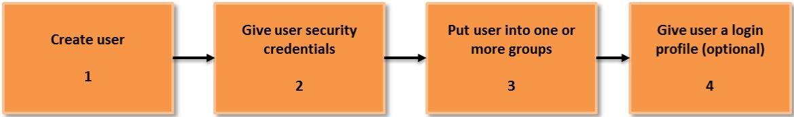

# Identity and Access Management (IAM)

- AWS Identity and Access Management (IAM) enables you to securely control access to AWS services and resources for your users.
- Using IAM, you can create and manage AWS users and groups, and use permissions to allow and deny their access to AWS resources. 
- IAM is a feature of your AWS account offered at no additional charge. You will be charged only for use of other AWS services by your users.

- Users – Create individual users.
- Groups – Manage permissions with groups.
- Permissions – Grant least privilege.
- Auditing – Turn on AWS CloudTrail.
- Password – Configure a strong password policy.
- MFA – Enable MFA for privileged users.
- Roles – Use IAM roles for Amazon EC2 instances.
- Sharing – Use IAM roles to share access.
- Rotate – Rotate security credentials regularly.
- Conditions – Restrict privileged access further with conditions.
- Root – Reduce or remove use of root.

---

# Manage Users

- Manage IAM users and their access—You can create users in IAM, assign them individual security credentials, or request temporary security credentials to provide users access to AWS services and resources.
- You can manage permissions in order to control which operations a user can perform. IAM users can be:
	- Privileged administrators who need console access to manage your AWS resources.
	- End users who need access to content in AWS.
	- Systems that need privileges to programmatically access your data in AWS.

- General Use Cases for Creating IAM Users
	- It is a security best practice to not use your root account because the root account grants access to all services and resources.
	- Grant users the minimum amount of privilege necessary, which is known as least privilege.
	- You have other people in your group who have varied access and authorization permissions.
	- When you use IAM users, it is easier to assign policies to specific users that access specific services and associated resources.
	- An IAM user can use the AWS CLI.
	- An IAM user can use a role.

- Using Groups for Easy Administration
	- A group is a collection of IAM users.
	- Groups let you assign permissions to a collection of users, which can make it easier to manage the permissions for those users.
	- For example, you could have a group called Admins and give that group the types of permissions that administrators typically need.
	- Any user in that group automatically has the permissions that are assigned to the group.
	- If a new user joins your organization and should have administrator privileges, you can assign the appropriate permissions by adding the user to that group.
	- Similarly, if a person changes jobs in your organization, instead of editing that user's permissions, you can remove him or her from the old group and add him or her to the new group.

# Permissions

- Permissions let you specify access to AWS resources.
- Permissions are granted to IAM entities (users, groups, and roles) and by default these entities start with no permissions.
- In other words, IAM entities can do nothing in AWS until you grant them your desired permissions.
- To give entities permissions, you can attach a policy that specifies the type of access, the actions that can be performed, and the resources on which the actions can be performed.
- In addition, you can specify any conditions that must be set for access to be allowed or denied.

