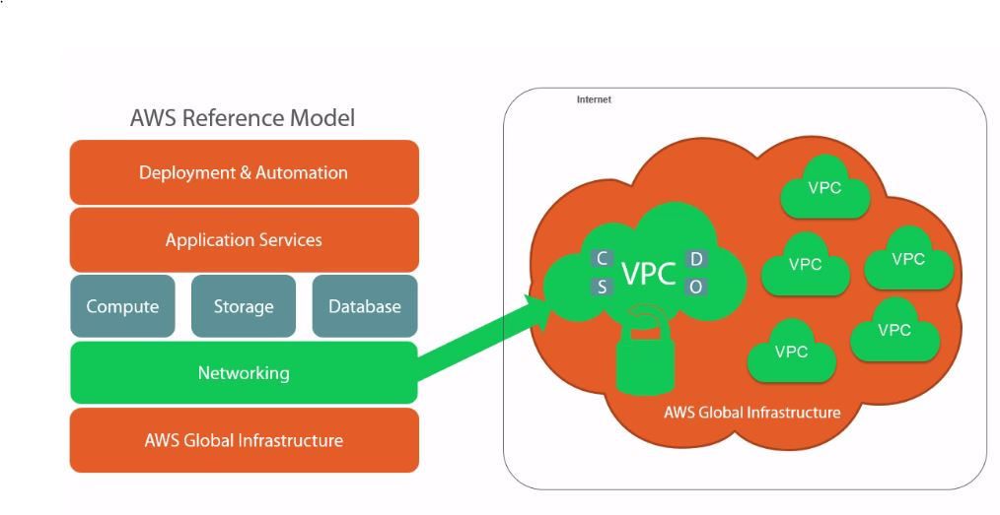

# Understanding Virtual Networking on AWS

***What is VPC?***

- For Networking in AWS we use Virtual Private Cloud (VPC)
- VPC is a logically isolated network in the AWS cloud
- It is the main network within we can have our subnets for EC2, RDS instances and every other thing which requires network.
- It gives control of the network architecture
- It has enhanced security. Within this VPC we can configure security groups through which we can control the Ingress and Egress
- Through VPC we can interconnect with other organizations which is called VPC Peering
- Through VPC we can assign Elastic/Public IP to our instances
- We can enable hybrid cloud (site-to-site VPN). Which enables us to connecto us to our on-premises infrastructure
- We can have single tenant dedicated server hardware  as well but costs high.
- VPC comes at no price
- VPN cost is $0.05/hr

---

***AWS Reference Model for VPC***

---

***IP Address Blocks***

- AWS reserves 5 adresses per a subnet for DNS, DHCP and for Gateway purpose etc.
- Single Region and Multi AZ functionality
- CIDR availability is 16 - 28
- We can select the IP prefix as per our choice from the 3 private classes with the CIDR availabillity mentioned above
